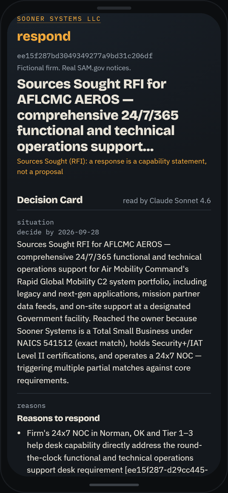
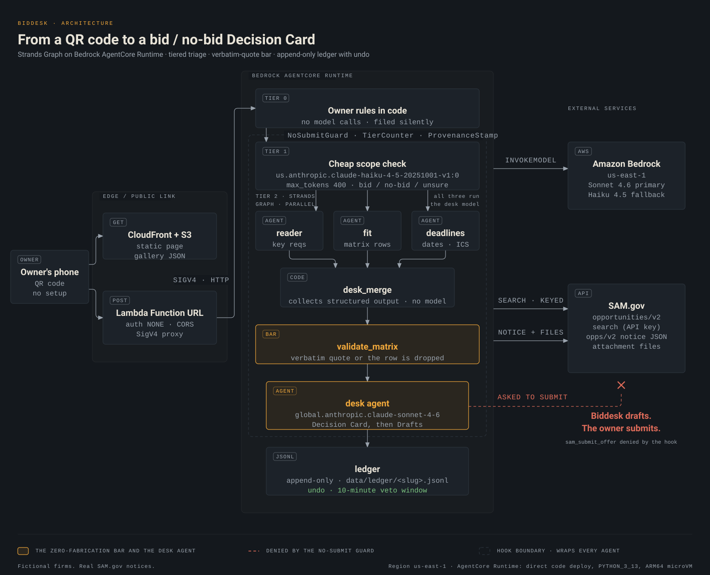
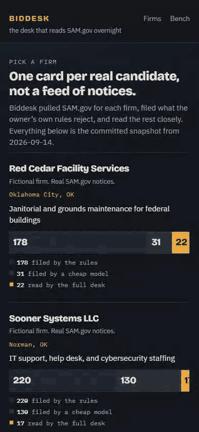
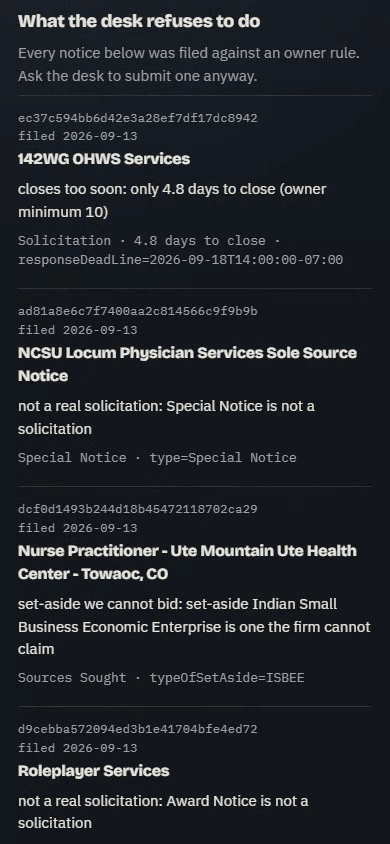
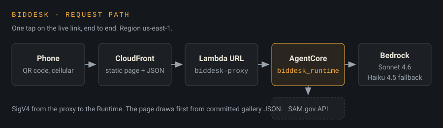

# Biddesk

**A bid desk agent for small federal contractors who have nobody whose job is reading SAM.gov.**


[](LICENSE)
[](https://dpnzgd4gtjs45.cloudfront.net/web/)

<table>
<tr>
<td width="340" valign="top"></td>
<td valign="top">

**Live demo: <https://dpnzgd4gtjs45.cloudfront.net/web/>**


Scan from a phone. No setup, no login, no upload.

</td>
</tr>
</table>

---

## Architecture at a glance



Full size: [`submission/architecture.svg`](submission/architecture.svg). The request path behind the live link is under [Deploy shape](#deploy-shape).

## The problem

Federal agencies post every solicitation on SAM.gov. The law sets a goal of 23 percent of federal prime contract dollars going to small businesses (15 U.S.C. 644(g)(1)(A)(i), [source](https://www.law.cornell.edu/uscode/text/15/644)). The firms that win set-aside work are not always the ones that do the work best. They are the ones with somebody whose job is reading SAM.gov every morning, screening the notices, building a compliance matrix per solicitation, and tracking two deadlines per bid. An owner-operated firm of 1 to 50 people does not have that person.

## What Biddesk does

A firm loads its profile once: NAICS codes, set-aside status, past performance, and the owner's rules in plain English ("no work over 200 miles", "never bid under ten days to close"). From then on Biddesk watches SAM.gov in the background.

Every new notice goes through three tiers. The owner's rules run first, in code, with zero model calls. What survives gets one cheap Haiku call. What survives that goes to the full desk: three specialists read the real attachments in parallel and produce a compliance matrix where every row quotes the sentence it came from, with the file and page number.

The owner sees one Decision Card per real candidate: the situation in two lines, three reasons for, three reasons against, the default if nobody answers, and the deadline. Everything below the bar is filed silently with a one-line reason, visible in a ledger the owner can open and undo.

**Measured on one real 30-day SAM.gov window (notices posted 2026-08-14 to 2026-09-13, three firms): 608 notices in, 408 filed by the owner's rules with zero model calls, 161 filed by one cheap model call each, 39 reached the full desk, 35 Decision Cards shipped.**

Live demo: <https://dpnzgd4gtjs45.cloudfront.net/web/>

Built for the AWS Agents for Humans hackathon, Professional track. Strands Agents on Amazon Bedrock, deployed on Bedrock AgentCore Runtime.

<table>
<tr>
<td width="340" valign="top"></td>
<td width="340" valign="top"></td>
</tr>
</table>

Left: a continuous screen recording of the live link, phone viewport, 2026-09-14. Firm list, tiering counts, the background week, the ledger, a Decision Card with its compliance matrix, an answer, and an undo. Right: the refusal scene on the same live link, where a guard hook cancels the submit tool call in code and the ledger records the denial.

---

## How it works

### 1. Tiered triage: most notices never reach a model

`src/biddesk/tiering.py`.

- **Tier 0: the owner's rules in code.** Notice type, set-aside eligibility, distance from the firm's city, days to close, minimum base period, past-performance overlap. Zero model calls. A rule fires only on a known fact: an absent notice type or an unknown place of performance never files anything. The bench asserts that no tier-0 row consumed a model call.
- **Tier 1: one cheap model call.** One Haiku 4.5 call with structured output (`ScopeCheck`) asking two things: is this the kind of work the firm does, and where is the work performed. A notice with no description text skips tier 1, because the work is in the attachments.
- **Tier 2: the full desk.** Only what survives.

Distance uses 41,197 US ZIP centroids from GeoNames (`data/geo/us_zip_centroids.csv`), not a model. Every distance carries a precision label. A state-centroid distance must exceed twice the owner's limit before it files anything. An unknown fact never fires a rule.

### 2. Three specialists in parallel on a Strands Graph

`src/biddesk/desk.py`. Three structured-output specialists on one `Graph`, then one desk agent.

- **reader**: which requirements the bid turns on, the scope, the evaluation basis, incumbent history.
- **fit**: one `MatrixRow` per key requirement, with the firm's answer drawn only from the profile.
- **deadlines**: every date with the sentence it came from, the set-aside note, the amendment note, and the calendar entries.

`Graph` runs its entry nodes in parallel; `Swarm` does not. Each specialist is wrapped in a `MultiAgentBase` node so one failing specialist does not kill the graph. The desk still runs with that specialist's fields marked unavailable.

### 3. The bar: every quote is checked in code

`validate_matrix()` keeps a matrix row only when its quote is a verbatim substring of the requirement it cites, and the file and page match. `validate_quotes()` does the same for supporting sentences against the full corpus. Dropped rows are counted, never repaired. The same validator runs on the Sonnet path and on the Haiku fallback, so the fallback cannot lower the bar.

### 4. Guard hooks, enforced in code and not in prompts

`src/biddesk/hooks.py`.

- `NoSubmitGuard` (a `HookProvider` on `BeforeToolCallEvent`) cancels any tool call whose name matches a submit, sign, send or pay stem, and writes a `denied_tool` row to the ledger. `NoSubmitIntervention` is the same rule as an `InterventionHandler` with `on_error="deny"`, so a crash inside the matcher fails closed.
  **Scope, stated plainly:** the URL check inspects tool-input values that are themselves bare URLs, not free text, and it is scoped to `sam.gov` hosts. A submit endpoint on another host is caught by the tool-name rule, not by the URL rule. That is a deliberate limit, recorded in `STATUS.md`.
- `ProvenanceStamp` (on `AfterToolCallEvent`) appends notice id, source file and page to every fetch or extract result, and logs the read. A failed tool result is not logged.
- `TierCounter` counts model calls and tool calls per invocation. This is the counter the demo page puts on screen.
- `PiiRedactor` masks emails, phones and SSN-shaped numbers. **Off by default**, because the contracting officer's published contact details are exactly what the owner needs to ask a question. Turn it on for traces that leave the machine.

### 5. Ledger with undo

`src/biddesk/ledger.py`. Append-only JSONL, one file per firm. Every row holds what, why (the evidence), when, and the undo. Silent actions sit behind a ten-minute veto window before they are final. An undo appends an `undone` row pointing at the original timestamp. Nothing is ever rewritten.

### 6. Decision Card

The only way a human is interrupted: situation in two lines, three reasons for, three reasons against, the default if nobody answers (filed as no-bid, nothing submitted), the decide-by date, and a link to the notice on SAM.gov. One tap answers it.

### What Biddesk does not do

Biddesk drafts. The owner submits. That is a product rule enforced in code by the `NoSubmitGuard` and `NoSubmitIntervention`, not in a system prompt. Ask the desk to submit an offer and the guard cancels the tool call before it runs and writes the denial to the ledger. There is no login and no user data. The three firms are fictional. Biddesk is not legal advice.

### Strands and AWS symbols used

| Symbol | Module | Where |
|---|---|---|
| `Agent`, `tool` | `strands` | `desk.py`, `tiering.py` |
| `BedrockModel` | `strands.models` | `desk.py`, `tiering.py` |
| `GraphBuilder`, `GraphState` | `strands.multiagent.graph` | `desk.py` |
| `MultiAgentBase`, `MultiAgentResult`, `NodeResult`, `Status` | `strands.multiagent.base` | `desk.py` |
| `HookProvider`, `HookRegistry` | `strands.hooks` | `hooks.py` |
| `BeforeToolCallEvent`, `AfterToolCallEvent`, `BeforeModelCallEvent`, `BeforeInvocationEvent` | `strands.hooks` | `hooks.py` |
| `InterventionHandler`, `Deny`, `Proceed` | `strands.interventions` | `hooks.py` |
| `structured_output_model=` on `Agent.__call__` and on `Agent(...)` | `strands` | `desk.py`, `tiering.py` |

Versions: Python 3.13, `strands-agents` 1.55.1, `bedrock-agentcore` 1.23.0, `@aws/agentcore` CLI 0.29.0. Region `us-east-1`. Models: `us.anthropic.claude-sonnet-4-6` primary, `us.anthropic.claude-haiku-4-5-20251001-v1:0` fallback, both on Amazon Bedrock.

### What the fit score is, and what it is not

Every card carries a fit score. It is computed in code, never by the model: meets = 1, partial = 0.5, gap = 0, unknown excluded, averaged over the matrix rows that survived `validate_matrix` **in that run**. The surviving row set is not stable run to run, so the score is not comparable across runs or models: the same notice on the same model scored 0.64 over 23 validated rows and 0.56 over 35. That is why the card says "fit N over K validated rows" and never a bare percentage. The tests pin that the number on the card equals `fit_from_matrix` over the rows that shipped, on all 35 cases, and the recommendation agreed across two models on every notice run on both. The earlier probe that asserted the score itself was model-independent was retired because the data denied it, not loosened until it passed.

---

## Bench

The 30-day window described above (Plains Med on its 7-day keyed window).

**Tier 0 (deterministic, reproducible with no model and no network).** Source: `data/bench/tiering_<slug>.json`, `counts`, read 2026-09-14.

| Firm | Notices | Filed by owner rules (tier 0) | Model calls | Tier-0 rule breakdown |
|---|---|---|---|---|
| Red Cedar Facility Services | 231 | 178 | 0 | distance 98, wrong notice type 43, ineligible set-aside 37 |
| Sooner Systems LLC | 367 | 220 | 0 | wrong notice type 201, ineligible set-aside 10, no past-performance overlap 9 |
| Plains Med Staffing | 10 | 10 | 0 | under 10 days to close 3, wrong notice type 3, ineligible set-aside 4 |

608 notices in, 408 decided by the owner's rules with zero model calls.

**Tier 1 and tier 2.** Same files, same read. One Haiku call per notice that survives tier 0.

| Firm | Reached tier 1 | Filed at tier 1 | Reason | Reached desk (tier 2) | Haiku calls |
|---|---|---|---|---|---|
| Red Cedar | 53 | 31 | out of scope 9, too far once the place was known 22 | 22 | 53 |
| Sooner Systems | 147 | 130 | out of scope 130 | 17 | 147 |
| Plains Med | 0 | 0 | n/a | 0 | 0 |

161 filed by one cheap model call each, 39 reached the full desk.

**Desk quality.** Source: `gallery/index.json` (produced 2026-09-14T06:58:56-05:00, 35 cases) and the per-case files in `gallery/cases/<slug>/<notice_id>.json`, summed 2026-09-14.

| Firm | Tier-2 candidates | Cards | Skipped by no-evidence gate | Rows kept | Rows dropped by `validate_matrix` | Model calls | Tokens in / out | bid / no-bid |
|---|---|---|---|---|---|---|---|---|
| Red Cedar | 22 | 20 | 2 | 589 | 68 | 100 | 1,226,622 / 261,053 | 1 / 19 |
| Sooner Systems | 17 | 15 | 2 | 483 | 57 | 75 | 971,477 / 207,979 | 1 / 14 |
| Plains Med | 0 | 0 | 0 | n/a | n/a | 0 | n/a | 0 / 0 |

Every shipped case ran on `us.anthropic.claude-sonnet-4-6` with `fallback_used` false. Tokens for the whole desk round, all 38 runs including the two forced-Haiku controls: 2,371,969 in and 512,922 out.

**Eval bench.** Source: `evals/BENCH.md` and `evals/bench.json`, run 2026-09-14 (rebuild with `PYTHONIOENCODING=utf-8 python evals/run_evals.py --parts 1 2 3`).

| Part | What it checks | Result | Model calls |
|---|---|---|---|
| 1. Tiering expectations | tier-0 re-run in code against every notice; every rule filing and every surfacing notice matches `evals/expected_<slug>.json` (ten filings per firm hand-checked against the notice fields) | PASS: 408 of 408 rule filings, 35 of 35 surfacing notices, 0 unexpected | 0 |
| 2. Matrix completeness, hand-marked | the phase-3 hand-marked "shall" list (ten attachment pages, one person, marked before the extractor was read) against the kept matrix rows, same file and page | 33 of 69 statements carried, 0.478 over the 7 marked notices that have a card (3 have none) | 0 |
| 3. Matrix completeness, judge | one structured-output call per card on `us.anthropic.claude-sonnet-4-6`: the kept rows against the case's extracted requirements, capped at the 150 highest-ranked | mean 0.653 over 34 of 35 cards; the one card with zero extracted requirements is left unscored, not given a vacuous 1.0 | 34 calls, 463,341 in / 39,373 out |

Part 2 is the only human ground truth in the repo, and most of its gap is the desk's own cap: the matrix keeps 26 to 37 ranked rows out of everything the extractor found, so a hand-marked page the ranking never reached scores near zero by construction (`54a51abc`: 29 kept rows cite the 394-requirement performance work statement; the marked page is the 5-requirement description document). Part 3 is one model's opinion of another model's output, useful as a relative signal across cards and not as ground truth. Tier 1 is not re-run by the bench; it is a model call.

**The background week.** Source: `data/bench/week_<slug>.json`, from `python -m biddesk.week`, run 2026-09-14 07:13 CT.

| Firm | Days with notices | Posted | Filed by rule | Filed by cheap model | To desk | Cards surfaced | Sent, no card | Amendments seen |
|---|---|---|---|---|---|---|---|---|
| Red Cedar | 25 (2026-08-14 to 09-14) | 231 | 178 | 31 | 22 | 20 | 2 | 15 |
| Sooner Systems | 25 (2026-08-14 to 09-13) | 367 | 220 | 130 | 17 | 15 | 2 | 25 |
| Plains Med | 5 (2026-09-07 to 09-11) | 10 | 10 | 0 | 0 | 0 | 0 | 3 |

Red Cedar's window runs one day longer than Sooner's (09-14 vs 09-13) because one Red Cedar notice carries a UTC publish date of 2026-09-14; the local-day boundary puts it in a different calendar day from the rest. Every surfaced id is a gallery card, no tier-0 or tier-1 notice surfaces, and the per-day sums equal the bench counts. Amendments are detected (15, 25, 3 in the table), but no deadline move is claimed: the six notices that carry a parent id have no cached previous version, and the replay does not fetch, so the page never shows "deadline moved" on this snapshot.

**Same-bar fallback.** Sonnet path against a forced-Haiku run on the two bar cases, same `validate_matrix`, same prompts. Source: `_runs/2026-09-13_desk_fix/REPORT.md`.

| Notice | Sonnet | Forced Haiku | Recommendation |
|---|---|---|---|
| `907ad2ce` (Sooner, AIE-ITS CSO) | no-bid, 31 kept / 1 dropped | no-bid, 39 kept / 3 dropped | agrees |
| `ee15f287` (Sooner, AEROS Sources Sought) | bid, 23 kept on the first run and 35 kept / 3 dropped on the shipped run | bid, 22 kept / 16 dropped | agrees |

The recommendation, which is what the card asserts, agreed on both. The fit score did not, for the reason given above.

**Reader (deterministic, no model calls).** Source: `python -m biddesk.reader report` TOTALS line, run 2026-09-14 06:57 CT.

| Notices | With attachments | Files | Pages | Requirements | Scanned files | Unsupported |
|---|---|---|---|---|---|---|
| 361 | 303 | 1,328 | 15,622 | 52,483 | 118 | 24 |

**Tests.** 303 passed, 1 warning in 155.58s (0:02:35), from `cd src && python -m pytest biddesk/tests -q`, run 2026-09-14 13:45 CT. Seven of them read the attachment cache under `data/attachments/` (1.4 GB, not in the repository) and skip on a clean clone.

### The second `bid` card, and why it is not a find

Two cases came back `bid`. The real one is `ee15f287` (Sooner Systems, "RFI: Air Force Enterprise Rapid Operations Support (AEROS)"). It is a Sources Sought, so a response is an RFI capability statement, not a proposal, and the card says so; it is still open, responses due 2026-09-30, fit 0.56 over 35 validated rows with 3 dropped.

The second, `d8c230fb` (Red Cedar, USACE Tulsa District, Robert S. Kerr janitorial in Sallisaw, OK), is named here only so nobody finds it unmentioned. Its matrix is 5 rows against a median of 34 across the 35 cases (which run 0 to 39), and those 5 read 0 met, 1 partial, 4 unknown. The notice had already closed on 2026-09-10, 3.6 days before the pull. Thin evidence produced a `bid` because there was almost nothing to find a gap in, which is the opposite of what the no-evidence gate is for. The page labels it closed and disables the answer buttons.

---

## Fictional firms, real solicitations

The three firms in the gallery are invented: Red Cedar Facility Services (Oklahoma City), Sooner Systems LLC (Norman), Plains Med Staffing (Tulsa). Their capabilities, past performance and owner rules are realistic but made up. The demo page labels each one "Fictional firm. Real SAM.gov notices.", and the video says so.

Everything on the opportunity side is real and public: the notices, their descriptions, their attachments, the agencies, the deadlines. Every one links to SAM.gov so a reader can check any row against the source document. City coordinates are public centroids used only for the owner's distance rule.

Nothing in this repo claims a rule fired that did not. Red Cedar's 12-month base-period rule (`rc-base`) is in the profile and enforced in code, but it does not appear in the snapshot's rule breakdown, so no demo or document claims it fired.

---

## Run it locally

Requires Python 3.13, AWS credentials with Bedrock model access in `us-east-1` for Sonnet 4.6 and Haiku 4.5, and a SAM.gov public API key (SAM.gov login.gov account, Profile, Account Details, "Public API Key"). Copy `.env.example` to `.env` and fill it. Never commit `.env`.

```bash
pip install -r requirements.txt

# 1. Pull real notices for all three firms (writes data/snapshot/<slug>.json)
python -m biddesk.snapshot --days 7 --show-one              # keyed API, needs the SAM.gov key
python -m biddesk.snapshot --public --days 30 --show-one    # unkeyed sam.gov search route, no key

# 2. Tiered triage bench (writes data/bench/tiering_<slug>.json)
python -m biddesk.tiering                      # tier 0 + tier 1 (one Haiku call per survivor)
python -m biddesk.tiering --no-model           # tier 0 only, no Bedrock, no network

# 3. Attachments: download, extract requirements, report totals
python -m biddesk.reader download
python -m biddesk.reader extract
python -m biddesk.reader report

# 4. The desk: specialists, matrix, card, drafts
python -m biddesk.desk run --profile red-cedar --all
python -m biddesk.desk run --profile red-cedar --notice <id8> --model haiku
python -m biddesk.desk refusal --profile plains-med      # the guard denies the submit call
python -m biddesk.desk gallery                            # assembles gallery/index.json
python -m biddesk.week                                    # replays the snapshot day by day (no model call)
python evals/run_evals.py --parts 1 2 3                   # eval bench; part 3 is 35 Sonnet calls

# 5. Tests (from src/)
python -m pytest biddesk/tests -q
```

Set `BIDDESK_OFFLINE=1` to force the committed snapshot and make every run deterministic without touching the network.

---

## Deploy shape



The request path behind the live link; the full component diagram is [`submission/architecture.svg`](submission/architecture.svg).

```
phone --HTTPS--> CloudFront --> S3 (static web/ + gallery/ JSON)          read-only, no auth
phone --HTTPS--> Lambda Function URL (CORS) --SigV4--> AgentCore Runtime (Strands desk)
                                                       |- Amazon Bedrock (Sonnet 4.6 / Haiku 4.5)
                                                       |- SAM.gov (keyed Get Opportunities API,
                                                          or the unkeyed sam.gov search route)
```

Everything a judge sees renders first from committed gallery JSON, so the page loads with no round trip. "Run live" actions call the Lambda URL and replace the cached panel with the live result, or show "showing the cached snapshot from `<date>`: `<reason>`" when SAM.gov is unreachable or the live call fails. The page never pretends a cached result is live.

The live pull tries the keyed SAM.gov API first. While the key is throttled, it takes the unkeyed search route the sam.gov site itself uses, and the answer names which route served it. Measured on the live link 2026-09-14 08:41 CT, Red Cedar, last 7 days: answered in 23 s, 68 notices pulled, 56 filed by rules, 10 by the cheap model, 2 to the desk, 12 model calls.

The refusal scene ("Ask the desk to submit this offer" on the Plains Med page) runs the desk live with the no-submit guard. Measured 2026-09-14 08:45 CT: 17 s, nothing sent.

AgentCore Runtime: direct code deployment (zip, `PYTHON_3_13`, ARM64), because the build machine has no Docker. Not yet done and not claimed anywhere: the check from a phone on cellular over the live link. That is an owner action before the video is recorded.

| Piece | Value |
|---|---|
| Site | <https://dpnzgd4gtjs45.cloudfront.net/web/> (CloudFront `EJS7ZC1JONY7Z` over a private S3 bucket) |
| Gallery JSON | <https://dpnzgd4gtjs45.cloudfront.net/gallery/index.json> |
| Proxy | <https://5mzjweelnir5lszqlfosvoyt4m0rzdbr.lambda-url.us-east-1.on.aws/> (Lambda `biddesk-proxy`, Function URL, SigV4 to the Runtime) |
| Runtime | AgentCore Runtime `biddesk_runtime-sBS5N4G0Fo`, region `us-east-1` |

Planned, not built: AgentCore Memory for standing owner rules, AgentCore Gateway wrapping the SAM.gov API with a Cedar no-submit policy, MCP server exposing `score_notice()` to other agents.

---

## Sources

Every fixture in `data/` carries its source URL and fetch date in [`data/SOURCES.md`](data/SOURCES.md): the SAM.gov Get Opportunities Public API v2 and its parameters, the public notice JSON fallback, the attachment resource links, the GeoNames postal code files and their CC BY 4.0 licence, and the pitch numbers with their primary sources.

No number appears in this README, the video, or the Devpost entry without a source in that file. A number that could not be sourced was cut, not estimated.

---

## License

MIT. See [`LICENSE`](LICENSE). Copyright 2026 Mohamad Yazan Sadoun.

GeoNames postal data under [`data/geo/`](data/geo/) is redistributed under CC BY 4.0, attributed in `data/SOURCES.md`. SAM.gov notices and attachments are US government public data.
